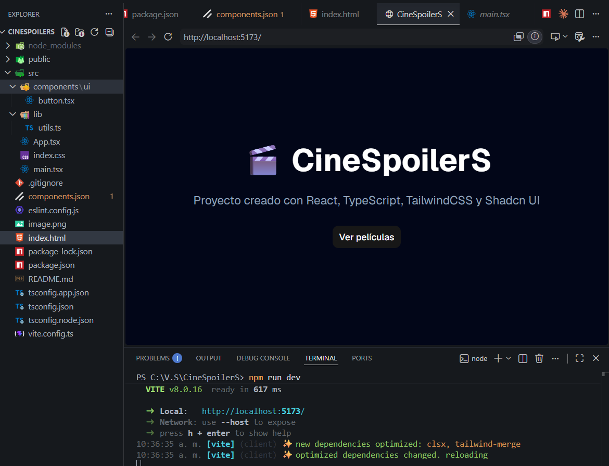
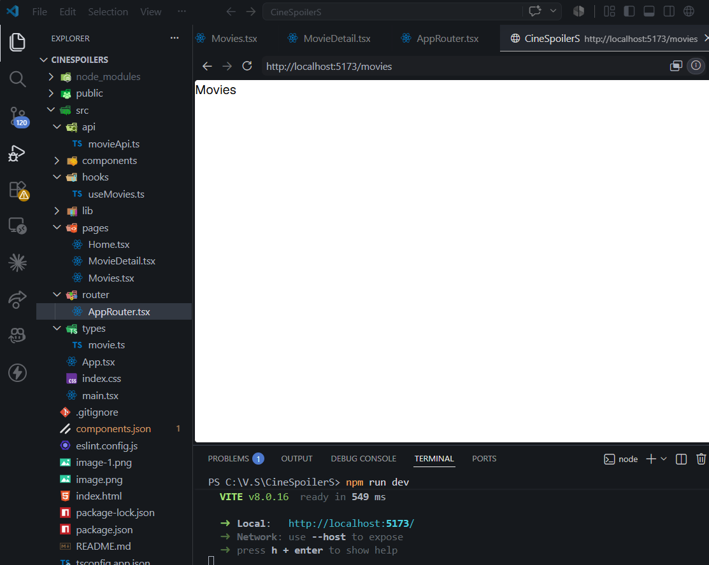
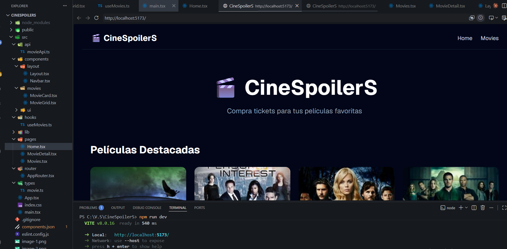
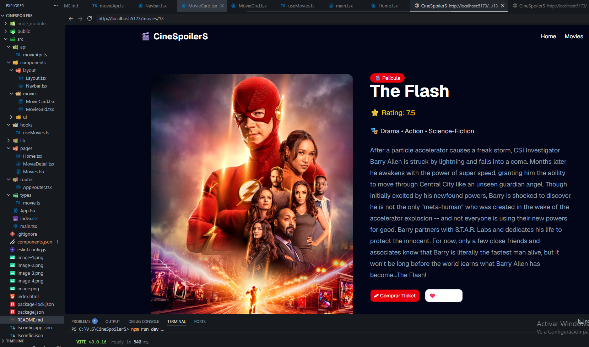
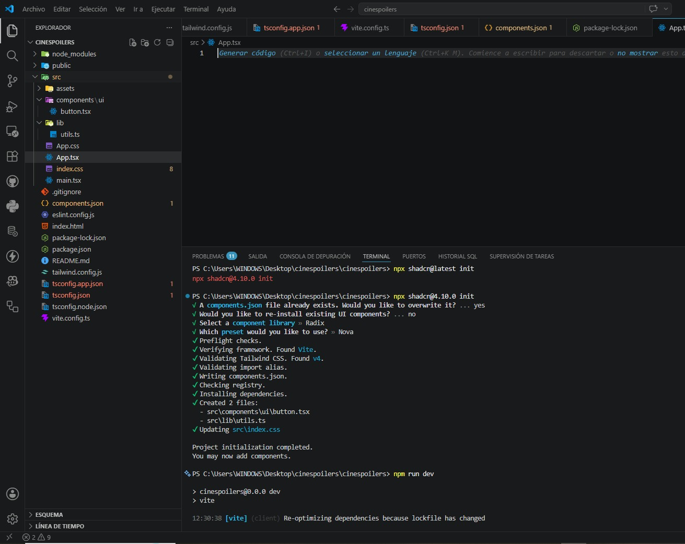
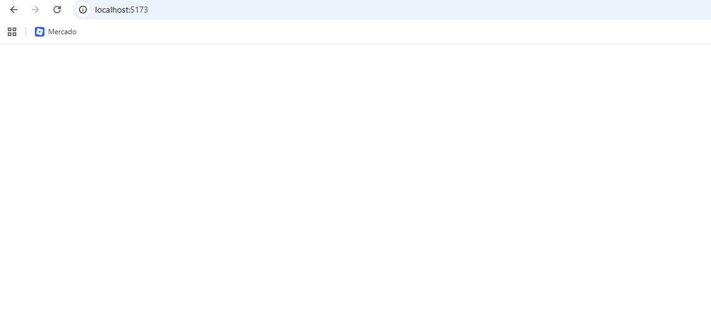

# 🎬 CineSpoilerS

Aplicación web desarrollada con **React + TypeScript** orientada a la venta de tickets de cine mediante una interfaz moderna, reutilizable y escalable.

---

# 📘 Información del Proyecto

**Proyecto:** CineSpoilerS

**Tipo:** E-commerce de Tickets de Cine

**Framework:** React + Vite + TypeScript

---

#  Integrales

- Kevin Quispe Ccolque
- Junior Cueva Fabian
- Calep Neyra Taype
- ChatGPT

---

# 🚀 Tecnologías Utilizadas

- React
- TypeScript
- Vite
- TailwindCSS
- Shadcn/UI (Tema Nova)
- React Router DOM
- Axios
- TanStack Query
- Git
- GitHub

---

# ⚙️ Actividades Realizadas

✅ Creción del proyecto con React + Vite + TypeScript
✅ Instalación y configuración de TailwindCSS
✅ Instalación y configuración de Shadcn/UI (Tema Nova)
✅ Desarrollo de Layout utilizando componentes UI
✅ Configuración de rutas con React Router
✅ Consumo de API mediante Axios
✅ Gestión de datos con TanStack Query
✅ Creación de Homepage
✅ Creación de listado de películas
✅ Creación de detalle de película

---

# 📂 Evidencias - Kevin Quispe Ccolque

### 🔹 Evidencia 1: Creación del proyecto e instalación de Shadcn/UI



---

### 🔹 Evidencia 2: Creación de rutas



---

### 🔹 Evidencia 3: Creación de Layout



---

### 🔹 Evidencia 4: Homepage y consumo de API



---

# 📂 Evidencias - Calep Neyra

### 🔹 Evidencia 1: Creación del proyecto e instalación de Shadcn/UI


---

### 🔹 Evidencia 2: Creación de rutas



---

### 🔹 Evidencia 3: Creación de Layout


---

### 🔹 Evidencia 4: Homepage y consumo de API


---

# ▶️ Ejecución del Proyecto

```bash
npm install
npm run dev
```

---

# 🧠 Conceptos Aplicados

### 🔹 React Router DOM
Permite gestionar la navegación entre páginas de forma dinámica.

### 🔹 Axios
Facilita el consumo de servicios REST mediante peticiones HTTP.

### 🔹 TanStack Query
Permite administrar el estado de datos remotos y optimizar consultas.

### 🔹 Shadcn/UI
Proporciona componentes reutilizables para construir interfaces modernas.

### 🔹 TailwindCSS
Framework CSS basado en utilidades para desarrollar interfaces rápidas y responsivas.

---

# 📌 Conclusión

Se implementó la base de una aplicación e-commerce de cine denominada **CineSpoilerS**, integrando React, TypeScript, Shadcn/UI, React Router, Axios y TanStack Query. La aplicación permite visualizar películas, consultar sus detalles y deja preparada una estructura escalable para futuras funcionalidades como carrito de compras y gestión de tickets.

